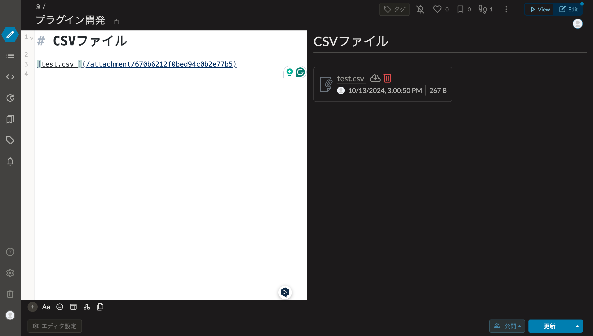

# GROIW Plugin CSV preview

This is a GROWI plugin for preview CSV file.

## Usage

### Upload a CSV file

You can upload a CSV file on the edit page.

### Preview the CSV file

You can preview the CSV file in edit page and view page.

### Ignore the CSV preview

If you don't want to preview the CSV file, you should change file name to `*.csv ` not end with `.csv`.

## License

MIT

